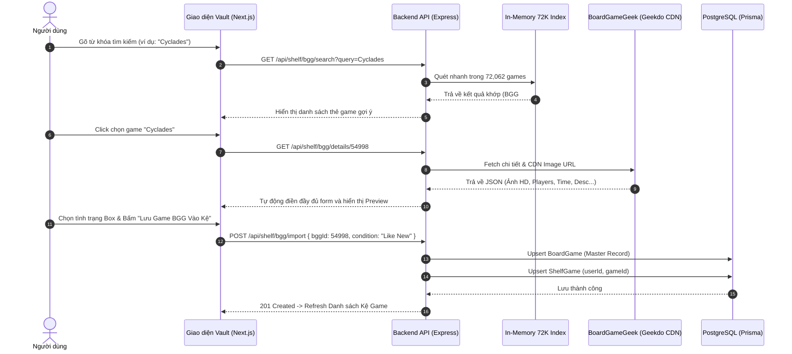

# 🎲 Tài Liệu Hướng Dẫn Tích Hợp BoardGameGeek (BGG) & Quản Lý Kho Game

Tài liệu này ghi lại toàn bộ kiến trúc, cơ chế hoạt động, cấu trúc dữ liệu và hướng dẫn sử dụng các tính năng kết nối trực tiếp đến **BoardGameGeek (BGG)** cùng hệ thống **Import CSV / Quản lý Kho Game (Vault)** đã được hoàn thiện trong dự án **BoardMates (Dicero)**.

---

## 📌 1. Tổng Quan Kiến Trúc & Nguồn Dữ Liệu BGG

Để mang lại trải nghiệm tra cứu và thêm game mượt mà nhất, hệ thống kết hợp 3 lớp dữ liệu:

1. **BGG Global Index (72,062 Games)**:
   - File dữ liệu: [`backend/data/bgg_72k_index.json`](file:///d:/FPT%20MATERIALS/MyOwn/BG-Project/backend/data/bgg_72k_index.json)
   - Chứa danh mục 72.062 boardgame được xếp hạng trên BGG toàn cầu, nạp trực tiếp vào RAM Backend khi khởi động giúp tra cứu bất kỳ tên game nào trên thế giới chỉ trong **< 5ms**.
2. **BGG Geekdo JSON API (Chi tiết & Ảnh HD)**:
   - Endpoint: `https://api.geekdo.com/api/geekitems?objectid={bggId}&objecttype=thing`
   - Trích xuất tự động: Tên game, năm phát hành, số người chơi (`minPlayers` - `maxPlayers`), thời lượng chơi (`playTime`), độ tuổi tối thiểu (`minAge`), thể loại (`categories`), nhà phát hành (`publisher`), mô tả đã làm sạch HTML, và link ảnh bìa gốc HD từ CDN `cf.geekdo-images.com`.
3. **BGG Hotness API (Xu hướng thế giới)**:
   - Endpoint: `https://api.geekdo.com/api/hotness`
   - Cung cấp danh sách Top 50 boardgame đang được quan tâm nhất thế giới trong ngày.

---

## 🖥️ 2. Giao Diện Người Dùng (Frontend UI/UX)

Trang quản lý: **[Kho Game / Vault](http://localhost:3007/vault)** ([`frontend/src/app/(main)/vault/page.js`](file:///d:/FPT%20MATERIALS/MyOwn/BG-Project/frontend/src/app/%28main%29/vault/page.js))

### 2.1. Modal "Thêm Game Lên Kệ" (2 Tab Tinh Gọn)
Khi người dùng bấm nút **"+ Thêm Game Lên Kệ"**, Modal hiển thị 2 Tab rõ ràng:

1. **🌐 Tab 1: 1. Chọn game từ BoardGameGeek (BGG)** *(Mặc định được mở)*:
   - **Ô tìm kiếm thời gian thực (Debounced 350ms)**: Người dùng có thể gõ **Tên Game** (ví dụ: *Catan, Cyclades, Nemesis, Quack, Wingspan, Brass, Dune, Terra Mystica, King of Tokyo, Ma Sói, Mèo Nổ...*) hoặc **BGG ID** (ví dụ: *13, 54998, 177302, 224517...*).
   - **Hỗ trợ gõ tiếng Việt không dấu & có dấu**: Tự động chuẩn hóa từ khóa tìm kiếm (`removeVietnameseTones`).
   - **Gợi ý Top Hotness**: Khi ô tìm kiếm trống, tự động hiển thị Top 50 game hot nhất thế giới để chọn nhanh bằng 1 click.
   - **Preview Card & Form cá nhân hóa**: Khi bấm chọn game, hệ thống tải thông số game từ BGG, cho phép chọn tình trạng box (*Mới 100%, Like New 99%, Đã bọc bài...*), trạng thái (*Đang trên kệ, Đang cho mượn, Muốn bán, Wishlist*), ghi chú và đánh giá sao cá nhân trước khi bấm **"Lưu Game BGG Vào Kệ"**.

2. **✏️ Tab 2: 2. Tự tạo game mới**:
   - Dành cho các tựa game tự thiết kế, game nội bộ hoặc game độc quyền không có trên BGG. Cho phép nhập thủ công tên, link ảnh, số người, thời lượng và thông số sở hữu.

---

### 2.2. Modal "Nạp Danh Sách Bằng File CSV" (Batch Import)
- **Tải file mẫu**: Nút **"Tải File Mẫu (CSV)"** gọi endpoint `/api/shelf/template/csv` tải file CSV có sẵn 10 game mẫu, hỗ trợ hiển thị tiếng Việt hoàn hảo trên Microsoft Excel nhờ chuẩn **UTF-8 BOM (`\uFEFF`)**.
- **Bảng Preview phân trang (Tối đa 10 game/trang)**: Khi chọn file `.csv`, hệ thống phân tích dữ liệu client-side và hiển thị bảng xem trước (Ảnh bìa, Tên game, Thể loại, Số người, Tình trạng, Trạng thái) kèm các nút chuyển trang Trước / Sau và nút xóa từng dòng.
- **Tạo kép tự động (Dual Record Creation)**: Khi bấm xác nhận nạp, backend tự động kiểm tra bảng `BoardGame` gốc (tạo mới nếu chưa có) và tạo đồng thời bản ghi trong bảng `ShelfGame` của người dùng.

---

## 🔌 3. Danh Sách API Endpoints Backend

Mã nguồn: [`backend/src/routes/shelf.js`](file:///d:/FPT%20MATERIALS/MyOwn/BG-Project/backend/src/routes/shelf.js) & [`backend/src/controller/shelf.controller.js`](file:///d:/FPT%20MATERIALS/MyOwn/BG-Project/backend/src/controller/shelf.controller.js)

### 3.1. Tìm kiếm BoardGame BGG (Search)
- **Method**: `GET`
- **URL**: `/api/shelf/bgg/search?query={tên_game_hoặc_id}`
- **Quyền**: Public
- **Ví dụ**: `/api/shelf/bgg/search?query=Cyclades` hoặc `/api/shelf/bgg/search?query=54998`
- **Response mẫu**:
```json
{
  "success": true,
  "data": [
    {
      "bggId": 54998,
      "name": "Cyclades",
      "imageUrl": "https://cf.geekdo-images.com/...",
      "year": 2009
    },
    {
      "bggId": 96778,
      "name": "Cyclades: Hades",
      "imageUrl": "https://cf.geekdo-images.com/...",
      "year": 2011
    }
  ]
}
```

---

### 3.2. Lấy Top Game Hotness từ BGG
- **Method**: `GET`
- **URL**: `/api/shelf/bgg/hotness`
- **Quyền**: Public
- **Response mẫu**:
```json
{
  "success": true,
  "data": [
    {
      "bggId": 224517,
      "name": "Brass: Birmingham",
      "imageUrl": "https://cf.geekdo-images.com/...",
      "bggLink": "https://boardgamegeek.com/boardgame/224517"
    }
  ]
}
```

---

### 3.3. Lấy Chi Tiết Thông Số & Ảnh HD theo BGG ID
- **Method**: `GET`
- **URL**: `/api/shelf/bgg/details/:bggId`
- **Ví dụ**: `/api/shelf/bgg/details/177302` (Nemesis)
- **Response mẫu**:
```json
{
  "success": true,
  "data": {
    "bggId": 177302,
    "name": "Nemesis",
    "yearPublished": 2018,
    "minPlayers": 1,
    "maxPlayers": 5,
    "playTime": 120,
    "minAge": 12,
    "categories": ["Miniatures", "Sci-Fi", "Horror", "Survival"],
    "publisher": "Awaken Realms",
    "imageUrl": "https://cf.geekdo-images.com/wKGkNuT1vH80Y2qj9M5fDg__original/img/P9A9dK5vG1xQ_Y6m3eG0L5m7t1U=/0x0/filters:format(jpeg)/pic4431802.jpg",
    "description": "Nemesis is a 1-5 player survival sci-fi game where players are woken up from hibernation...",
    "bggLink": "https://boardgamegeek.com/boardgame/177302"
  }
}
```

---

### 3.4. Nhập Game BGG vào Kệ Cá Nhân
- **Method**: `POST`
- **URL**: `/api/shelf/bgg/import`
- **Headers**: `Authorization: Bearer {token}`
- **Body**:
```json
{
  "bggId": 177302,
  "condition": "Like New 99%",
  "status": "ON_SHELF",
  "personalRating": 5.0,
  "personalNotes": "Đã bọc toàn bộ thẻ bài và mua thêm insert gỗ"
}
```

---

### 3.5. Tải Template CSV & Batch Import CSV
- **Tải File Mẫu**: `GET /api/shelf/template/csv`
- **Nạp Hàng Loạt**: `POST /api/shelf/batch-import`
  - **Headers**: `Authorization: Bearer {token}`
  - **Body**:
  ```json
  {
    "games": [
      {
        "name": "Catan",
        "condition": "Like New 99%",
        "status": "ON_SHELF",
        "personalRating": 4.5,
        "personalNotes": "Bản tiếng Việt",
        "imageUrl": "https://images.unsplash.com/photo-1610890716171-6b1bb98ffd09?auto=format&fit=crop&w=800&q=80",
        "categories": ["Chiến thuật", "Kinh tế"],
        "minPlayers": 3,
        "maxPlayers": 4,
        "playTime": 90,
        "age": 10
      }
    ]
  }
  ```

---

## 🔄 4. Sơ Đồ Quy Trình Hoạt Động



---

## 📋 5. Bảng Tham Chiếu Một Số Tựa Game Tiêu Biểu

| Tên Game | BGG ID | Thể loại | Số người | Link BGG |
| :--- | :---: | :--- | :---: | :--- |
| **Cyclades** | `54998` | Thần thoại, Đấu giá, Chiến thuật | 2 - 5 | [BGG #54998](https://boardgamegeek.com/boardgame/54998) |
| **The Quacks of Quedlinburg** | `244521` | Push-Your-Luck, Bag Building | 2 - 4 | [BGG #244521](https://boardgamegeek.com/boardgame/244521) |
| **Brass: Birmingham** (Rank #1 BGG) | `224517` | Kinh tế, Xây dựng mạng lưới | 2 - 4 | [BGG #224517](https://boardgamegeek.com/boardgame/224517) |
| **Nemesis** | `177302` | Khoa học viễn tưởng, Sinh tồn | 1 - 5 | [BGG #177302](https://boardgamegeek.com/boardgame/177302) |
| **Terra Mystica** | `120677` | Chiến thuật sâu, Không may rủi | 2 - 5 | [BGG #120677](https://boardgamegeek.com/boardgame/120677) |
| **King of Tokyo** | `70323` | Quái vật, Đổ xí ngầu, Party | 2 - 6 | [BGG #70323](https://boardgamegeek.com/boardgame/70323) |
| **Wingspan** | `266192` | Động vật học, Engine Building | 1 - 5 | [BGG #266192](https://boardgamegeek.com/boardgame/266192) |
| **Catan** | `13` | Giao thương, Đàm phán | 3 - 4 | [BGG #13](https://boardgamegeek.com/boardgame/13) |
| **Dune: Imperium** | `316554` | Deck building, Worker Placement | 1 - 4 | [BGG #316554](https://boardgamegeek.com/boardgame/316554) |
| **Azul** | `230802` | Xếp gạch nghệ thuật, Trừu tượng | 2 - 4 | [BGG #230802](https://boardgamegeek.com/boardgame/230802) |

---

## 🧪 6. Cách Chạy Thử API Trực Tiếp (cURL / Terminal)

```bash
# 1. Tìm kiếm BoardGame theo tên (hỗ trợ tiếng Việt hoặc tiếng Anh)
curl "http://localhost:8080/api/shelf/bgg/search?query=Cyclades"
curl "http://localhost:8080/api/shelf/bgg/search?query=Quack"

# 2. Lấy Top 50 game hot trên thế giới từ BGG
curl "http://localhost:8080/api/shelf/bgg/hotness"

# 3. Xem chi tiết game Cyclades (BGG ID: 54998)
curl "http://localhost:8080/api/shelf/bgg/details/54998"

# 4. Tải file mẫu CSV
curl "http://localhost:8080/api/shelf/template/csv" -o sample_shelf_games.csv
```
